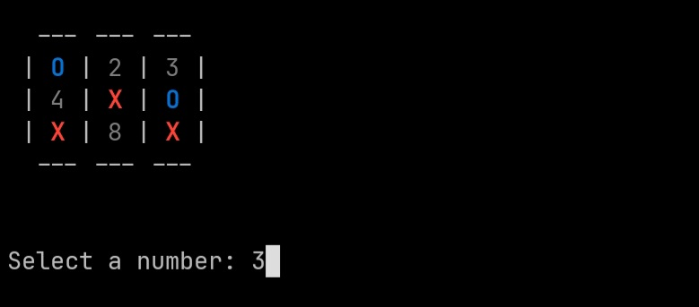

# Tic Tac Toe

Simple program in C that performs a tic-tac-toe
game through the terminal



## Requires
- gcc
- stdio
- stdlib
- make

## How to Play

```sh
git clone https://github.com/brunodavi/tic-tac-toe.c
cd tic-tac-toe.c/

make

./main.out
```
